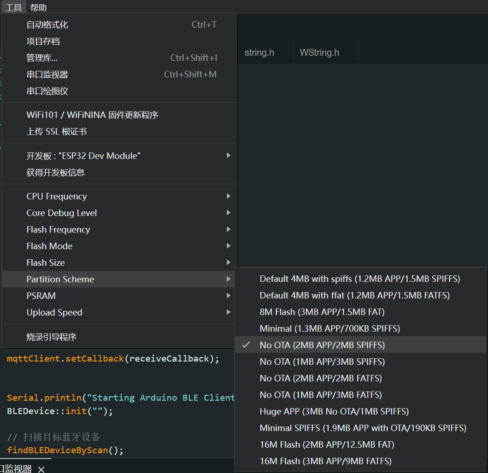

## 目标
 

尝试利用MQTT协议和BLE来联通不同的开发板模块，巩固[太极创客](www.taichi-maker.com)的学习

***
 

## 设计
 

流程：ESP8266(wifi) ->(publish发布) -> iot-server -> (subscrible订阅) -> (wifi)ESP32(ble) -> HC-08(ble模式) -> Arduino

简述：每个开发板连接一个RGB LED灯，在ESP8266控制自己连接的LED闪烁的通知发布led闪烁的指令，通过mqtt协议发布到iot公共服务端(然也物联)，ESP32订阅相应的主题，接收ESP8266发布的信息，控制ESP32自己的LED闪烁，同时通过BLE发送收的的指令给连接到Arduino上的HC-08(BLE模块)，HC-08通过串口连接到Arduino，控制板上的LED闪烁。

***
 

## 踩坑总结
 

### 1. Arduino的5V引脚如何给3.3V的HC-08供电？ 
通过简单的分压电路

   

### 2. ESP32引入WIFI和BLEDevice两个库后，编译上传时空间不足。
通过设置Flash分区
#### 2.1 选择正确的esp32开发板

#### 2.2 选择定制分区

   

### 3. Arduino通过Serial.readString()或Serial.parseInt()读取串口数据时，延时约1000ms

[解决办法](https://blog.csdn.net/shenfuwang/article/details/80262216)
